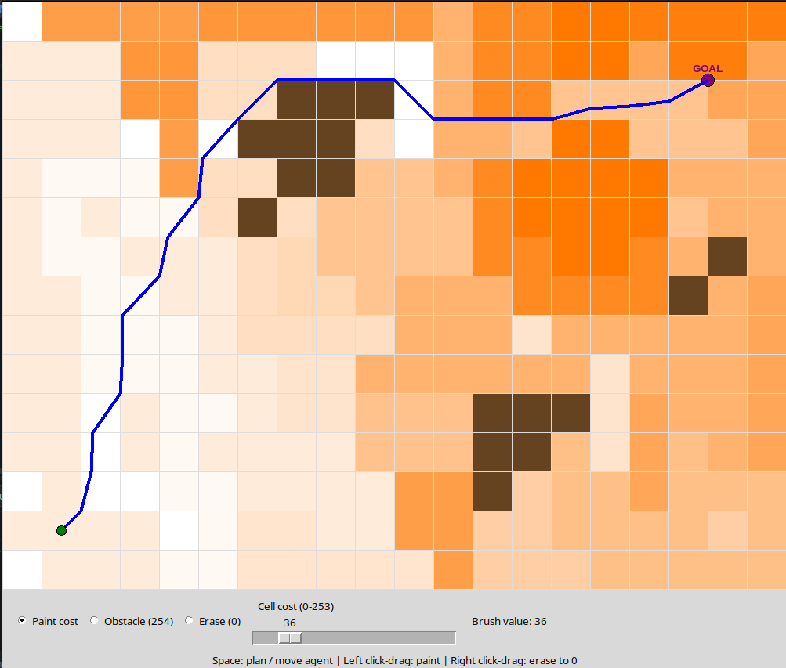

# Field D* Path Planning Algorithm

## Visualization


---
## Main Purpose
Classical grid-based algorithms  restrict robot movement to multiples of 45 degrees, which results in unnatural trajectories. Field D* solves this problem using linear interpolation. Instead of being constrained to grid edges and diagonals, the algorithm can generate optimal paths with a continuous range of headings.
As a result, the generated path is smooth and much easier to follow for the physical robot model.
---
## Requirements
Running the prototype requires a standard Python interpreter (version 3.x). No external mathematical libraries are needed besides the built-in ones.

---
## Usage
```bash
python3 simulation.py
```
---
## Literature
- https://www.ri.cmu.edu/pub_files/pub4/ferguson_david_2006_3/ferguson_david_2006_3.pdf
- https://www-robotics.jpl.nasa.gov/media/documents/fdstar3d.pdf
